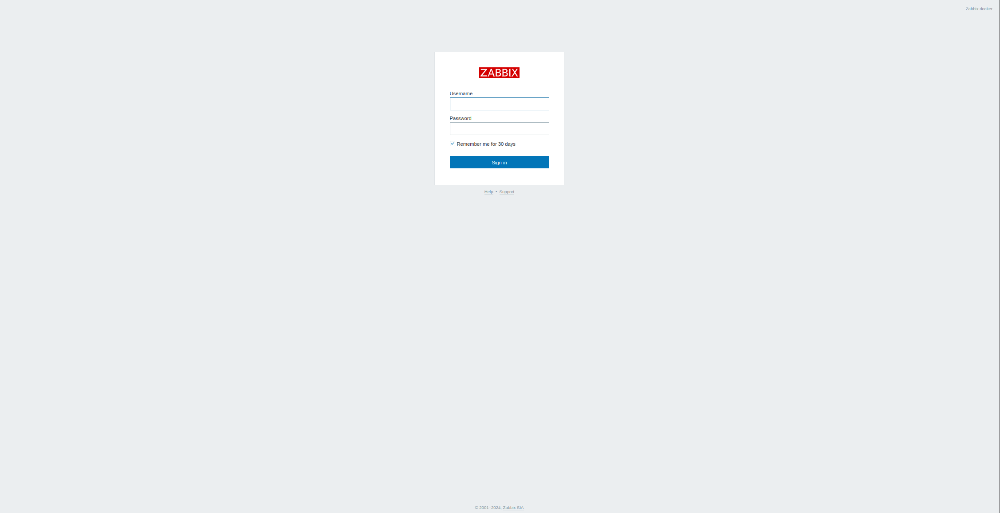
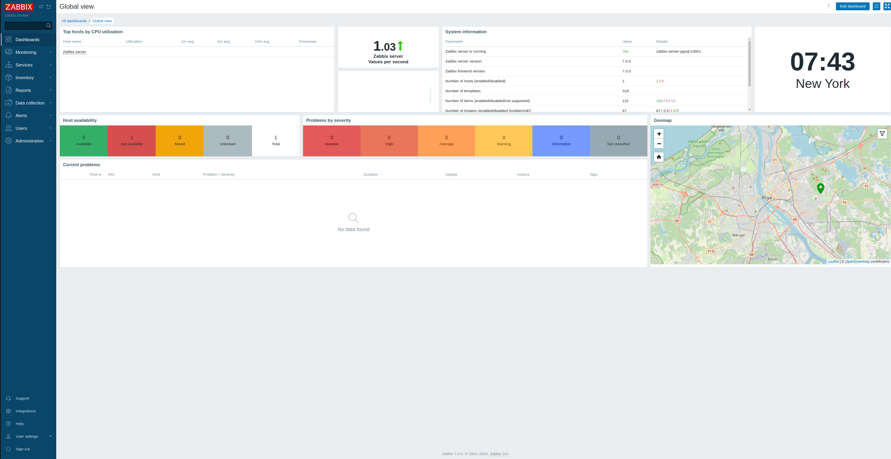

## medquest-zabbix7

* This repository contains a script to deploy Zabbix 7.0 LTS via docker containers. For any additional details or inquiries, please contact me at csargent@medquestmail.com.
* Tested on Ubuntu 22.04 VM
* [Zabbix 7 LTS](https://www.zabbix.com/whats_new_7_0)
* [Zabbix Documentation](https://github.com/zabbix/zabbix-docker/blob/7.0/README.md)

### Docker install for Ubuntu 
1. ssh user@IP
2. sudo -i 
3. curl -fsSL https://get.docker.com -o install-docker.sh && sudo sh install-docker.sh

### Deploy Zabbix 7.0 LTS
1. ssh user@IP
2. sudo -i 
3. git clone 
4. cd medquest-zabbix7
5. vim .env
* Update password
```
# Set your PostgreSQL credentials
POSTGRES_USER=zabbix
POSTGRES_PASSWORD=password
POSTGRES_DB=zabbix
```
6. ./zabbix7_deploy.sh
* Verify .sh scripts are executable chmod +x *.sh
7. docker ps 
```
CONTAINER ID   IMAGE                                             COMMAND                  CREATED          STATUS                    PORTS                                                                                NAMES
53df65487683   zabbix/zabbix-web-nginx-pgsql:alpine-7.0-latest   "docker-entrypoint.sh"   12 seconds ago   Up 11 seconds (healthy)   0.0.0.0:80->8080/tcp, [::]:80->8080/tcp, 0.0.0.0:443->8443/tcp, [::]:443->8443/tcp   zabbix-web-nginx-pgsql
3d12f7830dd8   zabbix/zabbix-server-pgsql:alpine-7.0-latest      "/usr/bin/docker-ent…"   20 seconds ago   Up 19 seconds             0.0.0.0:10051->10051/tcp, [::]:10051->10051/tcp                                      zabbix-server-pgsql
80336fb68165   zabbix/zabbix-snmptraps:alpine-7.0-latest         "/usr/sbin/snmptrapd…"   23 seconds ago   Up 22 seconds             0.0.0.0:162->1162/udp, [::]:162->1162/udp                                            zabbix-snmptraps
c1942d76a46a   postgres:16.3                                     "docker-entrypoint.s…"   27 seconds ago   Up 24 seconds             5432/tcp                                                                             postgres-server
```
8. http://10.217.53.101
* Admin zabbix


### Create certs and dhparam for SSL/TLS
1. openssl req -newkey rsa:2048 -nodes -keyout /etc/ssl/nginx/ssl.key -x509 -days 365 -out /etc/ssl/nginx/ssl.crt
2. openssl dhparam -out /etc/ssl/nginx/dhparam.pem 2048
3. chmod 444 /etc/ssl/nginx/ssl.key
4. chmod 644 /etc/ssl/nginx/ssl.crt
5. chmod 644 /etc/ssl/nginx/dhparam.pem
6. docker restart zabbix-web-nginx-pgsql
7. docker logs zabbix-web-nginx-pgsql -f
* Look for the following
```
** Adding Zabbix virtual host (HTTP)
** Enable SSL support for Nginx
** Preparing Zabbix frontend configuration file
########################################################
```
8. https://10.217.53.101
* Admin zabbix




